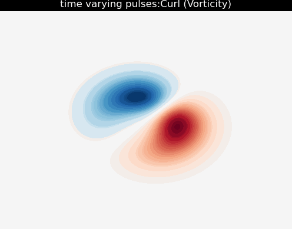
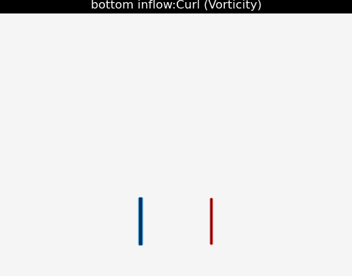
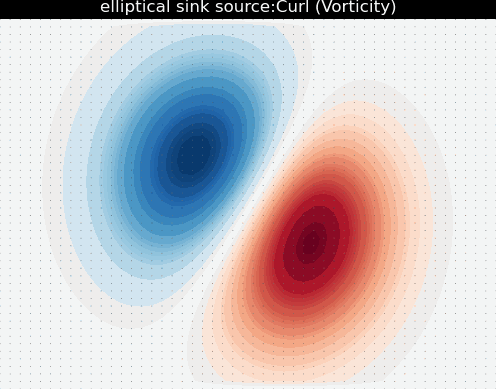

# Stable Diffusion Python Implementation
## How it works

This implementation is based on Jos Stam's 1999 paper, "Stable Fluids." 
The paper introduces a groundbreaking method for simulating incompressible fluid dynamics using a grid-based approach. 
By decoupling the pressure and velocity fields and using semi-Lagrangian advection alongside an implicit solver for diffusion, Stam achieved stable simulations even for large time steps and high Reynolds numbers.
The core algorithm can be summarized in four main steps: **add force**,  **advection**, **diffusion**, and **projection** in order to stabely solve Navier-Stokes for fluid simulation.

---
### 1. Force Application

External forces, such as gravity or user-defined inputs, are applied to the velocity field. These forces are typically modeled as a simple addition to the velocity:

\[$
\mathbf{u}^{n+1} = \mathbf{u}^n + \Delta t \, \mathbf{f}
$\]

where $\mathbf{f}$ represents the force field. This allows for dynamic interactions, such as swirling effects or controlled disturbances in the fluid.

---

### 2. Advection

Advection handles the transport of fluid properties (like velocity or density) through the domain. It determines how a quantity at each grid cell moves due to the velocity field. 
Instead of using forward advection, Stam's method employs **semi-Lagrangian advection**, which is stable even for large time steps.
Specifically in this step we look for the effect of advection of the fluid onto itself, because of this the propogation expression is non-linear, thereby it is solved as follows.
The velocity at a grid cell is computed by tracing a particle backward in time through the velocity field:

\[
$\mathbf{x}_{\text{prev}} = \mathbf{x} - \Delta t \, \mathbf{u}(\mathbf{x})$
\]

where:
- \($\mathbf{x}$\) is the current grid point,
- \($\Delta t$\) is the time step,
- \($\mathbf{u}(\mathbf{x})$\) is the velocity at point \($\mathbf{x}$\).

The value of velocity or density at the current grid point is then interpolated from the surrounding grid values at \($\mathbf{x}_{\text{prev}}$\). In this implementation, `scipy.interpolate.interpn` is used for interpolation, ensuring smooth and accurate updates.
For this impolementation instead of explicitly tracing the particle by applying RK2 over each cell and then applying a linear interpolation, 
we use an updated version of this step as described in Stam's later paper "Real-Time Fluid Dynamics for Games" for simplicity.
While we still use backtracking and linear interpolation we use instead explicitly match the backtrack function in one line.
This is less accurate than using an RK2, but is much simpler to implement and for the purposes of this implementation should produce the same results.

---

### 3. Diffusion

Diffusion accounts for the spreading of fluid quantities (like velocity) due to viscosity. 
This process is modeled using the **heat equation**:

\[$
\frac{\partial \mathbf{u}}{\partial t} = \nu \nabla^2 \mathbf{u}$
\]

where:
- $(\nu)$ is the viscosity,
- $(\nabla^2)$ is the Laplacian operator, representing the spatial second derivatives.

This step is implemented by solving the linear system that arises when discretizing the diffusion equation using finite differences:

\[$
\mathbf{u}^{n+1} - \nu \Delta t \nabla^2 \mathbf{u}^{n+1} = \mathbf{u}^n$
\]

Here, $(\mathbf{u}^{n+1})$ represents the velocity after diffusion, and $(\mathbf{u}^n)$ is the velocity before diffusion. 
The system is solved using the **Conjugate Gradient (CG)** method from `scipy.sparse.linalg.cg`. 
The Laplacian operator is approximated with finite differences on the grid.

---

### 4. Projection

Projection ensures that the velocity field remains divergence-free, satisfying the incompressibility condition:

\[$
\nabla \cdot \mathbf{u} = 0.
$
\]

This step involves solving a **Poisson equation** for the pressure field \(p\):

\[$
\nabla^2 p = \frac{1}{\Delta t} \nabla \cdot \mathbf{u}$\]

where $(\nabla \cdot \mathbf{u})$ is the divergence of the velocity field. Once $(p)$ is computed, the velocity field is corrected:

\[$
\mathbf{u}^{n+1} = \mathbf{u} - \Delta t \nabla p
$
\]

The projection step removes any divergence introduced in the advection or diffusion steps. Like diffusion, this step also uses the Conjugate Gradient solver to compute the pressure field efficiently.

---

### Visualization: Vorticity and Curl

To visualize fluid behavior intuitively, the **vorticity** (the curl of the velocity field) is computed:

\[$
\omega = \nabla \times \mathbf{u}.
$
\]

This highlights regions of rotation or swirling patterns in the fluid. The curl is approximated using discrete derivatives and used for animated visualizations with `plotly`.

---

### Boundary Conditions
The paper defines two types of boundary conditions, periodic and fixed. Wherein period the fluid wraps around the edges
For fixed boundary conditions it is most common to just set the velocity field to zero at the boundary. 
So that is what this implementation does. This is achieved by setting the values at the edges of the arrays to zero.
---


## How to use it

The simulation parameters, such as grid size, viscosity, time step, and external forces, are stored in a JSON file (`hyperparams.json`). 
In particular "force_func_name" can be updated to match any of the applied forces functions defined in "applied_forces".

To run the code the stops are as follows:
1. Install the required dependencies:
   ```bash
   conda env create --file environment.yaml
   conda activate stable-fluids-impl
   ```
2. Update **hyperparams.json** according to your desired output 
3. Run the code: 
    ```bash
    python main.py
    ``` 
   (can also run this from an ide)
4. You should see your output named according to your force function in the "outputs" folder as a .gif, 
in addition a playable plotly popup should appear to see the output.


## Example Outputs
## 1. Double Helix With Quiver


## 2. Time Varying Pulses (decaying over time)


## Bottom Inflow


## Four Inflows


## Elliptical Sink With Quiver


## Random Noise Input With Quiver

## References
- [Joe Stam's Stable Fluid paper](https://pages.cs.wisc.edu/~chaol/data/cs777/stam-stable_fluids.pdf)
- [Joe Stam's Stable Fluids for games](http://graphics.cs.cmu.edu/nsp/course/15-464/Fall09/papers/StamFluidforGames.pdf)